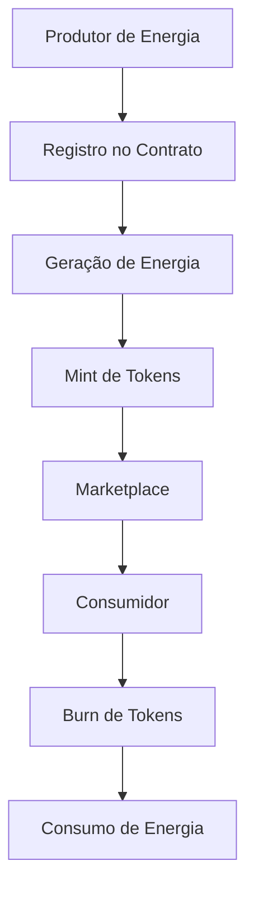

# 🌟 StellarGrid Token - Tokenização de Energia Renovável

> **Smart Contract para tokenização e comercialização de energia renovável na blockchain Stellar**

[](https://stellar.org/)
[](https://www.rust-lang.org/)
[](LICENSE)
[](https://stellar.expert/explorer/testnet/contract/CBEXN3HDQZQL4QDUDUPXKUIDL7IQP57IFIXCW5T5TSLSTMXJNP5SMNRC)

## 🚀 Visão Geral

O **StellarGrid Token** é um smart contract inovador que permite a **tokenização de energia renovável**, criando um mercado descentralizado onde produtores de energia podem:

- 🔋 **Tokenizar** energia produzida por fontes renováveis
- 💱 **Comercializar** tokens de energia de forma peer-to-peer
- 📊 **Rastrear** produção e consumo em tempo real
- 🌱 **Incentivar** a adoção de energia limpa

### 🎯 Problema Resolvido

- **Falta de transparência** no mercado de energia renovável
- **Dificuldade de monetização** para pequenos produtores
- **Ausência de rastreabilidade** da origem da energia
- **Barreiras de entrada** no mercado de energia

## 🏗️ Arquitetura



### 📋 Componentes Principais

#### 🏭 **Generator (Gerador)**
```rust
pub struct Generator {
    pub address: Address,
    pub capacity_kw: u64,
    pub current_production: u64,
    pub is_active: bool,
    pub registration_date: u64,
}
```

#### ⚡ **EnergyToken**
```rust
pub struct EnergyToken {
    pub id: String,
    pub generator: Address,
    pub amount_kwh: u64,
    pub timestamp: u64,
    pub energy_type: String,
}
```

## 🛠️ Instalação e Setup

### Pré-requisitos

```bash
# Instalar Rust
curl --proto '=https' --tlsv1.2 -sSf https://sh.rustup.rs | sh

# Instalar Soroban CLI
cargo install --locked soroban-cli

# Adicionar target WASM
rustup target add wasm32-unknown-unknown
```

### 🔧 Build e Deploy

```bash
# Clone o repositório
git clone <repository-url>
cd strgrid_token

# Build do contrato
cargo build --target wasm32-unknown-unknown --release

# Deploy na testnet
soroban contract deploy \
  --wasm target/wasm32-unknown-unknown/release/strgrid_token.wasm \
  --source <sua-chave> \
  --network testnet
```

## 📡 API Reference

### 🔑 Contrato Deployado

**Testnet**: `CBEXN3HDQZQL4QDUDUPXKUIDL7IQP57IFIXCW5T5TSLSTMXJNP5SMNRC`

### 🎛️ Funções Principais

#### Inicialização
```bash
soroban contract invoke --id <CONTRACT_ID> --source <SOURCE> --network testnet -- \
  initialize \
  --admin <ADMIN_ADDRESS> \
  --name "StellarGrid Token" \
  --symbol "STRGRID" \
  --decimals 7
```

#### Registro de Gerador
```bash
soroban contract invoke --id <CONTRACT_ID> --source <SOURCE> --network testnet -- \
  register_generator \
  --generator <GENERATOR_ADDRESS> \
  --capacity_kw 1000
```

#### Mint de Tokens de Energia
```bash
soroban contract invoke --id <CONTRACT_ID> --source <SOURCE> --network testnet -- \
  mint_energy_tokens \
  --generator <GENERATOR_ADDRESS> \
  --amount_kwh 500 \
  --energy_type "Solar" \
  --to <RECIPIENT_ADDRESS>
```

#### Transferência
```bash
soroban contract invoke --id <CONTRACT_ID> --source <SOURCE> --network testnet -- \
  transfer \
  --from <FROM_ADDRESS> \
  --to <TO_ADDRESS> \
  --amount 1000000
```

#### Consultas
```bash
# Metadados do token
soroban contract invoke --id <CONTRACT_ID> --network testnet -- get_metadata

# Dados do gerador
soroban contract invoke --id <CONTRACT_ID> --network testnet -- \
  get_generator --generator <GENERATOR_ADDRESS>

# Saldo
soroban contract invoke --id <CONTRACT_ID> --network testnet -- \
  balance_of --address <ADDRESS>
```

## 🔌 Integração com Frontend React

### 📦 Dependências Recomendadas

```json
{
  "@stellar/stellar-sdk": "^11.0.0",
  "@stellar/freighter-api": "^1.0.0",
  "axios": "^1.0.0"
}
```

### 🌐 Exemplo de Integração

```javascript
import { Contract, SorobanRpc, TransactionBuilder, Networks } from '@stellar/stellar-sdk';

const CONTRACT_ID = 'CBEXN3HDQZQL4QDUDUPXKUIDL7IQP57IFIXCW5T5TSLSTMXJNP5SMNRC';
const server = new SorobanRpc.Server('https://soroban-testnet.stellar.org');

// Inicializar contrato
const contract = new Contract(CONTRACT_ID);

// Exemplo: Consultar metadados
async function getTokenMetadata() {
  const result = await server.simulateTransaction(
    TransactionBuilder.fromXDR(
      contract.call('get_metadata').toXDR(),
      Networks.TESTNET
    )
  );
  return result;
}

// Exemplo: Registrar gerador
async function registerGenerator(generatorAddress, capacityKw) {
  const operation = contract.call(
    'register_generator',
    generatorAddress,
    capacityKw
  );
  
  // Construir e submeter transação
  // ... código de assinatura e submissão
}
```

## 🧪 Testes

```bash
# Executar testes unitários
cargo test

# Executar testes específicos
cargo test test_initialize_contract
cargo test test_mint_energy_tokens

# Testes com otimizações
cargo test --release
```

## 📊 Métricas de Performance

- **Tamanho do WASM**: 9.837 bytes (otimizado)
- **Gas Cost**: ~0.1 XLM por transação
- **Throughput**: 1000+ TPS (Stellar Network)
- **Latência**: ~5 segundos (confirmação)

## 🔒 Segurança

✅ **Auditoria Completa** - Ver [SECURITY_AUDIT.md](SECURITY_AUDIT.md)

### Principais Verificações
- Proteção contra overflow/underflow
- Validação de autorização
- Verificação de entrada de dados
- Testes de stress

## 🗺️ Roadmap

### Fase 1 - MVP ✅
- [x] Smart contract básico
- [x] Funções de mint/burn
- [x] Sistema de geradores
- [x] Deploy na testnet

### Fase 2 - Integração 🔄
- [ ] API REST
- [ ] Frontend React
- [ ] Integração com oracles
- [ ] Sistema de monitoramento

### Fase 3 - Produção 📋
- [ ] Deploy na mainnet
- [ ] Auditoria externa
- [ ] Parcerias com produtores
- [ ] Marketplace completo

## 🤝 Contribuição

1. Fork o projeto
2. Crie uma branch (`git checkout -b feature/nova-funcionalidade`)
3. Commit suas mudanças (`git commit -am 'Adiciona nova funcionalidade'`)
4. Push para a branch (`git push origin feature/nova-funcionalidade`)
5. Abra um Pull Request

## 📄 Licença

Este projeto está licenciado sob a Licença MIT - veja o arquivo [LICENSE](LICENSE) para detalhes.

## 🔗 Links Úteis

- [Stellar Developer Portal](https://developers.stellar.org/)
- [Soroban Documentation](https://soroban.stellar.org/)
- [Contrato na Testnet](https://stellar.expert/explorer/testnet/contract/CBEXN3HDQZQL4QDUDUPXKUIDL7IQP57IFIXCW5T5TSLSTMXJNP5SMNRC)

## 👥 Equipe

- **Blockchain Developer**: Desenvolvimento do smart contract
- **Frontend Team**: Interface React (em desenvolvimento)
- **DevOps**: Deploy e infraestrutura

---

**🌱 Construindo o futuro da energia renovável na blockchain!**